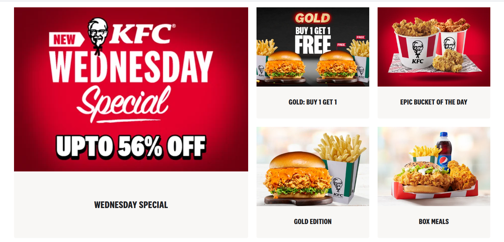

# Csss-task

```
<!DOCTYPE html>
<html lang="en">
<head>
  <meta charset="UTF-8">
  <meta name="viewport" content="width=device-width, initial-scale=1">
  <title>Sticky Header Example</title>
  <style>
    /* Basic reset */
    * {
      margin: 0;
      padding: 0;
      box-sizing: border-box;
    }

    body {
      font-family: Arial, sans-serif;
    }

    /* Sticky Header */
    header {
      position: sticky;
      top: 0;
      background-color: #ffffff;
      display: flex;
      justify-content: space-between;
      align-items: center;
      padding: 15px 30px;
      box-shadow: 0 4px 6px rgba(0, 0, 0, 0.1);
      z-index: 1000;
    }

    /* Logo */
    .logo {
      font-size: 1.5rem;
      font-weight: bold;
      color: #333;
    }

    /* Navigation Menu */
    nav ul {
      list-style: none;
      display: flex;
      gap: 25px;
    }

    nav ul li a {
      text-decoration: none;
      color: #333;
      font-weight: 500;
      transition: color 0.3s ease;
    }

    nav ul li a:hover {
      color: #007bff;
    }

    /* Dummy content to enable scroll */
    .content {
      padding: 40px 30px;
      line-height: 1.6;
    }
  </style>
</head>
<body>

  <header>
    <div></div>
    <div class="search-bar">
        <input type="text" placeholder="Search...">
      </div>
    <nav>
      <ul>
        <li><a href="#">Home</a></li>
        <li><a href="#">About</a></li>
        <li><a href="#">Services</a></li>
        <li><a href="#">Contact</a></li>
      </ul>
    </nav>
  </header>

  <div class="content">
    <h1>Welcome to the Page</h1>
    
    
    
    <!-- Repeat the paragraph to simulate long content -->
    <p style="margin-top: 1000px;">End of content.</p>
  </div>

</body>
</html>

```

